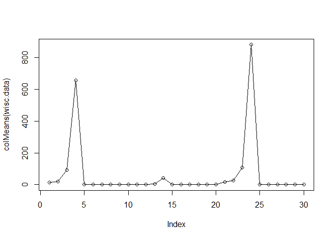
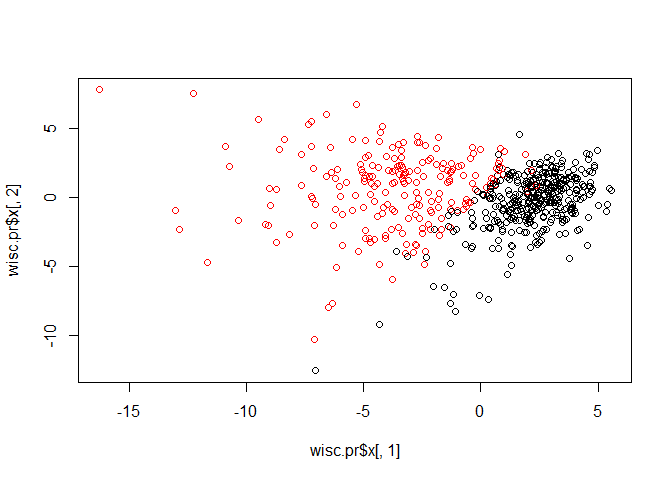
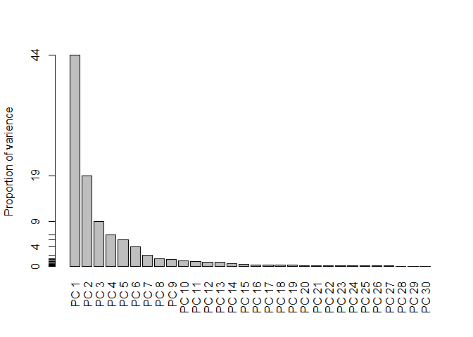
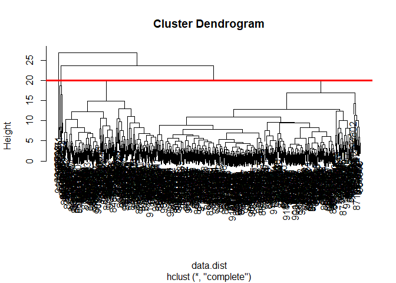

#Unsupervised learning analysis of cancer cells

input data


```r
url <- "https://bioboot.github.io/bggn213_S18/class-material/WisconsinCancer.csv"


wisc.df <- read.csv(url)

head(wisc.df)
```

```
##         id diagnosis radius_mean texture_mean perimeter_mean area_mean
## 1   842302         M       17.99        10.38         122.80    1001.0
## 2   842517         M       20.57        17.77         132.90    1326.0
## 3 84300903         M       19.69        21.25         130.00    1203.0
## 4 84348301         M       11.42        20.38          77.58     386.1
## 5 84358402         M       20.29        14.34         135.10    1297.0
## 6   843786         M       12.45        15.70          82.57     477.1
##   smoothness_mean compactness_mean concavity_mean concave.points_mean
## 1         0.11840          0.27760         0.3001             0.14710
## 2         0.08474          0.07864         0.0869             0.07017
## 3         0.10960          0.15990         0.1974             0.12790
## 4         0.14250          0.28390         0.2414             0.10520
## 5         0.10030          0.13280         0.1980             0.10430
## 6         0.12780          0.17000         0.1578             0.08089
##   symmetry_mean fractal_dimension_mean radius_se texture_se perimeter_se
## 1        0.2419                0.07871    1.0950     0.9053        8.589
## 2        0.1812                0.05667    0.5435     0.7339        3.398
## 3        0.2069                0.05999    0.7456     0.7869        4.585
## 4        0.2597                0.09744    0.4956     1.1560        3.445
## 5        0.1809                0.05883    0.7572     0.7813        5.438
## 6        0.2087                0.07613    0.3345     0.8902        2.217
##   area_se smoothness_se compactness_se concavity_se concave.points_se
## 1  153.40      0.006399        0.04904      0.05373           0.01587
## 2   74.08      0.005225        0.01308      0.01860           0.01340
## 3   94.03      0.006150        0.04006      0.03832           0.02058
## 4   27.23      0.009110        0.07458      0.05661           0.01867
## 5   94.44      0.011490        0.02461      0.05688           0.01885
## 6   27.19      0.007510        0.03345      0.03672           0.01137
##   symmetry_se fractal_dimension_se radius_worst texture_worst
## 1     0.03003             0.006193        25.38         17.33
## 2     0.01389             0.003532        24.99         23.41
## 3     0.02250             0.004571        23.57         25.53
## 4     0.05963             0.009208        14.91         26.50
## 5     0.01756             0.005115        22.54         16.67
## 6     0.02165             0.005082        15.47         23.75
##   perimeter_worst area_worst smoothness_worst compactness_worst
## 1          184.60     2019.0           0.1622            0.6656
## 2          158.80     1956.0           0.1238            0.1866
## 3          152.50     1709.0           0.1444            0.4245
## 4           98.87      567.7           0.2098            0.8663
## 5          152.20     1575.0           0.1374            0.2050
## 6          103.40      741.6           0.1791            0.5249
##   concavity_worst concave.points_worst symmetry_worst
## 1          0.7119               0.2654         0.4601
## 2          0.2416               0.1860         0.2750
## 3          0.4504               0.2430         0.3613
## 4          0.6869               0.2575         0.6638
## 5          0.4000               0.1625         0.2364
## 6          0.5355               0.1741         0.3985
##   fractal_dimension_worst  X
## 1                 0.11890 NA
## 2                 0.08902 NA
## 3                 0.08758 NA
## 4                 0.17300 NA
## 5                 0.07678 NA
## 6                 0.12440 NA
```

How may dianosis are cancer vs no cancer


```r
table(wisc.df$diagnosis)
```

```
## 
##   B   M 
## 357 212
```

Convert excluding the first two column with non-numeric values to a matrix


```r
#Convert the features of the data: wisc.data
##also remove the column 33 because it has the NAs
wisc.data <- as.matrix (wisc.df [-c(1, 2, 33)])


#selecting now the id column as the row names instead of the numerical ordered values
row.names(wisc.data) <- wisc.df$id
```


```r
head(wisc.data)
```

```
##          radius_mean texture_mean perimeter_mean area_mean smoothness_mean
## 842302         17.99        10.38         122.80    1001.0         0.11840
## 842517         20.57        17.77         132.90    1326.0         0.08474
## 84300903       19.69        21.25         130.00    1203.0         0.10960
## 84348301       11.42        20.38          77.58     386.1         0.14250
## 84358402       20.29        14.34         135.10    1297.0         0.10030
## 843786         12.45        15.70          82.57     477.1         0.12780
##          compactness_mean concavity_mean concave.points_mean symmetry_mean
## 842302            0.27760         0.3001             0.14710        0.2419
## 842517            0.07864         0.0869             0.07017        0.1812
## 84300903          0.15990         0.1974             0.12790        0.2069
## 84348301          0.28390         0.2414             0.10520        0.2597
## 84358402          0.13280         0.1980             0.10430        0.1809
## 843786            0.17000         0.1578             0.08089        0.2087
##          fractal_dimension_mean radius_se texture_se perimeter_se area_se
## 842302                  0.07871    1.0950     0.9053        8.589  153.40
## 842517                  0.05667    0.5435     0.7339        3.398   74.08
## 84300903                0.05999    0.7456     0.7869        4.585   94.03
## 84348301                0.09744    0.4956     1.1560        3.445   27.23
## 84358402                0.05883    0.7572     0.7813        5.438   94.44
## 843786                  0.07613    0.3345     0.8902        2.217   27.19
##          smoothness_se compactness_se concavity_se concave.points_se
## 842302        0.006399        0.04904      0.05373           0.01587
## 842517        0.005225        0.01308      0.01860           0.01340
## 84300903      0.006150        0.04006      0.03832           0.02058
## 84348301      0.009110        0.07458      0.05661           0.01867
## 84358402      0.011490        0.02461      0.05688           0.01885
## 843786        0.007510        0.03345      0.03672           0.01137
##          symmetry_se fractal_dimension_se radius_worst texture_worst
## 842302       0.03003             0.006193        25.38         17.33
## 842517       0.01389             0.003532        24.99         23.41
## 84300903     0.02250             0.004571        23.57         25.53
## 84348301     0.05963             0.009208        14.91         26.50
## 84358402     0.01756             0.005115        22.54         16.67
## 843786       0.02165             0.005082        15.47         23.75
##          perimeter_worst area_worst smoothness_worst compactness_worst
## 842302            184.60     2019.0           0.1622            0.6656
## 842517            158.80     1956.0           0.1238            0.1866
## 84300903          152.50     1709.0           0.1444            0.4245
## 84348301           98.87      567.7           0.2098            0.8663
## 84358402          152.20     1575.0           0.1374            0.2050
## 843786            103.40      741.6           0.1791            0.5249
##          concavity_worst concave.points_worst symmetry_worst
## 842302            0.7119               0.2654         0.4601
## 842517            0.2416               0.1860         0.2750
## 84300903          0.4504               0.2430         0.3613
## 84348301          0.6869               0.2575         0.6638
## 84358402          0.4000               0.1625         0.2364
## 843786            0.5355               0.1741         0.3985
##          fractal_dimension_worst
## 842302                   0.11890
## 842517                   0.08902
## 84300903                 0.08758
## 84348301                 0.17300
## 84358402                 0.07678
## 843786                   0.12440
```

#create diagnosis vector by completing the mission code


```r
diagnosis <- as.numeric (wisc.df$diagnosis == "M")


#knowing how many people have the malignant diagnosis
sum(diagnosis)
```

```
## [1] 212
```

#know how many patients do we have

```r
nrow(wisc.data)
```

```
## [1] 569
```

```r
#can do dim() and it will give us both dimensions of the data
```


How many variables in the data are suffixed with the _mean

```r
#first is the prefix, second where to look for in your data, value is so you can see the names of the actual variable instead of getting a numeric value

length(grep("mean", colnames(wisc.data), value = TRUE))
```

```
## [1] 10
```

```r
#length will give you the total values of the variables that have the preffix
```


Principal component analysis (PCA)


```r
plot(colMeans(wisc.data), type = "o")
```

<!-- -->


Perform PCA on wis.data


```r
wisc.pr <- prcomp(wisc.data, scale=TRUE)
```


How are we doing

```r
summary(wisc.pr)
```

```
## Importance of components:
##                           PC1    PC2     PC3     PC4     PC5     PC6
## Standard deviation     3.6444 2.3857 1.67867 1.40735 1.28403 1.09880
## Proportion of Variance 0.4427 0.1897 0.09393 0.06602 0.05496 0.04025
## Cumulative Proportion  0.4427 0.6324 0.72636 0.79239 0.84734 0.88759
##                            PC7     PC8    PC9    PC10   PC11    PC12
## Standard deviation     0.82172 0.69037 0.6457 0.59219 0.5421 0.51104
## Proportion of Variance 0.02251 0.01589 0.0139 0.01169 0.0098 0.00871
## Cumulative Proportion  0.91010 0.92598 0.9399 0.95157 0.9614 0.97007
##                           PC13    PC14    PC15    PC16    PC17    PC18
## Standard deviation     0.49128 0.39624 0.30681 0.28260 0.24372 0.22939
## Proportion of Variance 0.00805 0.00523 0.00314 0.00266 0.00198 0.00175
## Cumulative Proportion  0.97812 0.98335 0.98649 0.98915 0.99113 0.99288
##                           PC19    PC20   PC21    PC22    PC23   PC24
## Standard deviation     0.22244 0.17652 0.1731 0.16565 0.15602 0.1344
## Proportion of Variance 0.00165 0.00104 0.0010 0.00091 0.00081 0.0006
## Cumulative Proportion  0.99453 0.99557 0.9966 0.99749 0.99830 0.9989
##                           PC25    PC26    PC27    PC28    PC29    PC30
## Standard deviation     0.12442 0.09043 0.08307 0.03987 0.02736 0.01153
## Proportion of Variance 0.00052 0.00027 0.00023 0.00005 0.00002 0.00000
## Cumulative Proportion  0.99942 0.99969 0.99992 0.99997 1.00000 1.00000
```


##Plot PCA RESULTS


```r
plot(wisc.pr$x[,1], wisc.pr$x[,2], col=diagnosis+1)
```

<!-- -->


Scree-plot variance explained


```r
pve <- wisc.pr$sdev^2 / sum(wisc.pr$sdev^2)
# Plot variance explained for each principal component
plot(pve, xlab = "Principal Component", 
     ylab = "Proportion of Variance Explained", 
     ylim = c(0, 1), type = "o")
```

<!-- -->


```r
barplot(pve, names.arg = paste ("PC", 1:length(pve)), las = 2, axes = FALSE, ylab = "Proportion of varience")

#we want each bar to have the name of pve
#we want the labels to be rounded to two digitals
axis(2, at = pve, labels = round(pve,2)*100)
```

<!-- -->

#Section 3
Hierarchical clustering of case data

##Scale the wisc.dat data: data.scaled

```r
data.scaled <- scale(wisc.data)
```


##Calculate the Euclidean distances between all pairs 


```r
data.dist <- dist(data.scaled)
```


##Create a hierarchical clustering model using complete linkage


```r
wisc.hclust <- hclust(data.dist, method ="complete")
```

Lets plot our tree


```r
plot(wisc.hclust)
abline(h=20, col="red", lwd=3)
```

<!-- -->

Lets cut the tree
#Selecting number of clusters


```r
wisc.hclust.clusters <- cutree(wisc.hclust, k=4)
```


##How do these groups match our 'diagnosis'

```r
table(wisc.hclust.clusters, diagnosis)
```

```
##                     diagnosis
## wisc.hclust.clusters   0   1
##                    1  12 165
##                    2   2   5
##                    3 343  40
##                    4   0   2
```


Section 4
#Creating k-means model o n wisc.data


```r
wisc.km <- kmeans(data.scaled, centers=2, nstart = 20)
table(wisc.km$cluster)
```

```
## 
##   1   2 
## 380 189
```

##compare to expert 'diagnosis'

```r
table(wisc.km$cluster, diagnosis)
```

```
##    diagnosis
##       0   1
##   1 343  37
##   2  14 175
```


Section 5
##Clustering on PCA results


```r
wisc.pr.hclust <- hclust (dist(wisc.pr$x[,1:3]), method = "ward.D2")
plot(wisc.pr.hclust)
```

<!-- -->


#Cut this hierarchical clustering


```r
wisc.pr.hclust.clusters <- cutree(wisc.pr.hclust, k=4)

plot(wisc.pr$x[,1:2], col=wisc.pr.hclust.clusters)
```

<!-- -->

Compare to actual diagnoses

```r
table(wisc.pr.hclust.clusters, diagnosis)
```

```
##                        diagnosis
## wisc.pr.hclust.clusters   0   1
##                       1   0 111
##                       2  24  68
##                       3 184  32
##                       4 149   1
```


```r
#install.packages("rgl")
```


```r
#library(rgl)
#plot3d(wisc.pr$x)
```


