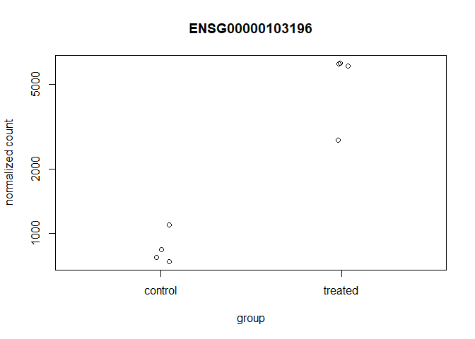

```r
library(BiocInstaller)
```

```
## Bioconductor version 3.6 (BiocInstaller 1.28.0), ?biocLite for help
```

```
## A new version of Bioconductor is available after installing the most
##   recent version of R; see http://bioconductor.org/install
```

obtaining the data 

```r
counts <- read.csv("data/airway_scaledcounts.csv", stringsAsFactors = FALSE)
metadata <-  read.csv("data/airway_metadata.csv", stringsAsFactors = FALSE)
```


```r
colnames(counts)[-1] ==
metadata$id
```

```
## [1] TRUE TRUE TRUE TRUE TRUE TRUE TRUE TRUE
```

Calculating the mean for the control values


```r
#Find id for those labeled controls
control <- metadata[metadata[,"dex"]=="control",]

#Get the mean of the control 
#selecting the 4 ids from our new table "control" to be looked at the table counts. Then we are adding each row and dividing it by the sample number, which is four.
control.mean <- rowSums( counts[ ,control$id] )/ nrow(control)

#If we leave the 4 and our sample number changes then this formula will no longer be calculating the mean. So i changed the 4 for nrow(control)

names(control.mean) <- counts$ensgene
```


Calculating the mean for the treated samples

```r
#Find id for those labeled controls
treated <- metadata[metadata[,"dex"]=="treated",]

#Get the mean of the control 
#selecting the 4 ids from our new table "control" to be looked at the table counts. Then we are adding each row and dividing it by the sample number, which is four.
treated.mean <- rowSums( counts[ ,treated$id] )/ nrow(treated)

#If we leave the 4 and our sample number changes then this formula will no longer be calculating the mean. So i changed the 4 for nrow(control)

names(treated.mean) <- counts$ensgene
```


Take a look at each

```r
meancounts <- data.frame(control.mean, treated.mean)

colSums(meancounts)
```

```
## control.mean treated.mean 
##     23005324     22196524
```


Plot it

```r
plot(meancounts)
```

<!-- -->


Plot with log axis so we can see our data

```r
plot(meancounts, log="xy")
```

```
## Warning in xy.coords(x, y, xlabel, ylabel, log): 15032 x values <= 0
## omitted from logarithmic plot
```

```
## Warning in xy.coords(x, y, xlabel, ylabel, log): 15281 y values <= 0
## omitted from logarithmic plot
```

<!-- -->


#Calculate log2foldchange and add it to meancounts

```r
meancounts$log2fc <- log2(meancounts[,"treated.mean"]/meancounts[,"control.mean"])
head(meancounts)
```

```
##                 control.mean treated.mean      log2fc
## ENSG00000000003       900.75       658.00 -0.45303916
## ENSG00000000005         0.00         0.00         NaN
## ENSG00000000419       520.50       546.00  0.06900279
## ENSG00000000457       339.75       316.50 -0.10226805
## ENSG00000000460        97.25        78.75 -0.30441833
## ENSG00000000938         0.75         0.00        -Inf
```

```r
# NaN (“not a number””) and -Inf (negative infinity) results
```


#The which will tell you what the zero values are true of the meancounts

```r
zero.vals <- which(meancounts[,1:2]==0, arr.ind=TRUE)

to.rm <- unique(zero.vals[,1])

head(zero.vals)
```

```
##                 row col
## ENSG00000000005   2   1
## ENSG00000004848  65   1
## ENSG00000004948  70   1
## ENSG00000005001  73   1
## ENSG00000006059 121   1
## ENSG00000006071 123   1
```

Now remove the zero count containing genes

```r
mycounts <- meancounts[-to.rm,]
head(mycounts)
```

```
##                 control.mean treated.mean      log2fc
## ENSG00000000003       900.75       658.00 -0.45303916
## ENSG00000000419       520.50       546.00  0.06900279
## ENSG00000000457       339.75       316.50 -0.10226805
## ENSG00000000460        97.25        78.75 -0.30441833
## ENSG00000000971      5219.00      6687.50  0.35769358
## ENSG00000001036      2327.00      1785.75 -0.38194109
```


```r
up.ind <- mycounts$log2fc > 2
down.ind <- mycounts$log2fc < (-2)
```


```r
paste("up:", sum(up.ind))
```

```
## [1] "up: 250"
```

```r
paste("down:", sum(down.ind))
```

```
## [1] "down: 367"
```


```r
anno <- read.csv("data/annotables_grch38.csv")
head(anno)
```

```
##           ensgene entrez   symbol chr     start       end strand
## 1 ENSG00000000003   7105   TSPAN6   X 100627109 100639991     -1
## 2 ENSG00000000005  64102     TNMD   X 100584802 100599885      1
## 3 ENSG00000000419   8813     DPM1  20  50934867  50958555     -1
## 4 ENSG00000000457  57147    SCYL3   1 169849631 169894267     -1
## 5 ENSG00000000460  55732 C1orf112   1 169662007 169854080      1
## 6 ENSG00000000938   2268      FGR   1  27612064  27635277     -1
##          biotype
## 1 protein_coding
## 2 protein_coding
## 3 protein_coding
## 4 protein_coding
## 5 protein_coding
## 6 protein_coding
##                                                                                                  description
## 1                                                          tetraspanin 6 [Source:HGNC Symbol;Acc:HGNC:11858]
## 2                                                            tenomodulin [Source:HGNC Symbol;Acc:HGNC:17757]
## 3 dolichyl-phosphate mannosyltransferase polypeptide 1, catalytic subunit [Source:HGNC Symbol;Acc:HGNC:3005]
## 4                                               SCY1-like, kinase-like 3 [Source:HGNC Symbol;Acc:HGNC:19285]
## 5                                    chromosome 1 open reading frame 112 [Source:HGNC Symbol;Acc:HGNC:25565]
## 6                          FGR proto-oncogene, Src family tyrosine kinase [Source:HGNC Symbol;Acc:HGNC:3697]
```

```r
head(mycounts)
```

```
##                 control.mean treated.mean      log2fc
## ENSG00000000003       900.75       658.00 -0.45303916
## ENSG00000000419       520.50       546.00  0.06900279
## ENSG00000000457       339.75       316.50 -0.10226805
## ENSG00000000460        97.25        78.75 -0.30441833
## ENSG00000000971      5219.00      6687.50  0.35769358
## ENSG00000001036      2327.00      1785.75 -0.38194109
```


```r
results <- merge(mycounts, anno, by.x = "row.names", by.y = "ensgene")
head(results)
```

```
##         Row.names control.mean treated.mean      log2fc entrez   symbol
## 1 ENSG00000000003       900.75       658.00 -0.45303916   7105   TSPAN6
## 2 ENSG00000000419       520.50       546.00  0.06900279   8813     DPM1
## 3 ENSG00000000457       339.75       316.50 -0.10226805  57147    SCYL3
## 4 ENSG00000000460        97.25        78.75 -0.30441833  55732 C1orf112
## 5 ENSG00000000971      5219.00      6687.50  0.35769358   3075      CFH
## 6 ENSG00000001036      2327.00      1785.75 -0.38194109   2519    FUCA2
##   chr     start       end strand        biotype
## 1   X 100627109 100639991     -1 protein_coding
## 2  20  50934867  50958555     -1 protein_coding
## 3   1 169849631 169894267     -1 protein_coding
## 4   1 169662007 169854080      1 protein_coding
## 5   1 196651878 196747504      1 protein_coding
## 6   6 143494811 143511690     -1 protein_coding
##                                                                                                  description
## 1                                                          tetraspanin 6 [Source:HGNC Symbol;Acc:HGNC:11858]
## 2 dolichyl-phosphate mannosyltransferase polypeptide 1, catalytic subunit [Source:HGNC Symbol;Acc:HGNC:3005]
## 3                                               SCY1-like, kinase-like 3 [Source:HGNC Symbol;Acc:HGNC:19285]
## 4                                    chromosome 1 open reading frame 112 [Source:HGNC Symbol;Acc:HGNC:25565]
## 5                                                     complement factor H [Source:HGNC Symbol;Acc:HGNC:4883]
## 6                                          fucosidase, alpha-L- 2, plasma [Source:HGNC Symbol;Acc:HGNC:4008]
```


```r
library("AnnotationDbi")
```

```
## Loading required package: stats4
```

```
## Loading required package: BiocGenerics
```

```
## Loading required package: parallel
```

```
## 
## Attaching package: 'BiocGenerics'
```

```
## The following objects are masked from 'package:parallel':
## 
##     clusterApply, clusterApplyLB, clusterCall, clusterEvalQ,
##     clusterExport, clusterMap, parApply, parCapply, parLapply,
##     parLapplyLB, parRapply, parSapply, parSapplyLB
```

```
## The following objects are masked from 'package:stats':
## 
##     IQR, mad, sd, var, xtabs
```

```
## The following objects are masked from 'package:base':
## 
##     anyDuplicated, append, as.data.frame, cbind, colMeans,
##     colnames, colSums, do.call, duplicated, eval, evalq, Filter,
##     Find, get, grep, grepl, intersect, is.unsorted, lapply,
##     lengths, Map, mapply, match, mget, order, paste, pmax,
##     pmax.int, pmin, pmin.int, Position, rank, rbind, Reduce,
##     rowMeans, rownames, rowSums, sapply, setdiff, sort, table,
##     tapply, union, unique, unsplit, which, which.max, which.min
```

```
## Loading required package: Biobase
```

```
## Welcome to Bioconductor
## 
##     Vignettes contain introductory material; view with
##     'browseVignettes()'. To cite Bioconductor, see
##     'citation("Biobase")', and for packages 'citation("pkgname")'.
```

```
## Loading required package: IRanges
```

```
## Loading required package: S4Vectors
```

```
## 
## Attaching package: 'S4Vectors'
```

```
## The following object is masked from 'package:base':
## 
##     expand.grid
```

```r
library("org.Hs.eg.db")
```

```
## 
```


To get a list of all available key types


```r
columns(org.Hs.eg.db)
```

```
##  [1] "ACCNUM"       "ALIAS"        "ENSEMBL"      "ENSEMBLPROT" 
##  [5] "ENSEMBLTRANS" "ENTREZID"     "ENZYME"       "EVIDENCE"    
##  [9] "EVIDENCEALL"  "GENENAME"     "GO"           "GOALL"       
## [13] "IPI"          "MAP"          "OMIM"         "ONTOLOGY"    
## [17] "ONTOLOGYALL"  "PATH"         "PFAM"         "PMID"        
## [21] "PROSITE"      "REFSEQ"       "SYMBOL"       "UCSCKG"      
## [25] "UNIGENE"      "UNIPROT"
```


```r
mycounts$symbol <- mapIds(org.Hs.eg.db,
                     keys=row.names(mycounts),
                     column="SYMBOL",
                     keytype="ENSEMBL",
                     multiVals="first")
```

```
## 'select()' returned 1:many mapping between keys and columns
```

```r
#entrez
mycounts$entrez <- mapIds(org.Hs.eg.db,
                     keys=row.names(mycounts),
                     column="ENTREZID",
                     keytype="ENSEMBL",
                     multiVals="first")
```

```
## 'select()' returned 1:many mapping between keys and columns
```

```r
mycounts$uniprot <- mapIds(org.Hs.eg.db,
                     keys=row.names(mycounts),
                     column="UNIPROT",
                     keytype="ENSEMBL",
                     multiVals="first")
```

```
## 'select()' returned 1:many mapping between keys and columns
```


```r
head(mycounts[up.ind,])
```

```
##                 control.mean treated.mean   log2fc  symbol entrez
## ENSG00000004799       270.50      1429.25 2.401558    PDK4   5166
## ENSG00000006788         2.75        19.75 2.844349   MYH13   8735
## ENSG00000008438         0.50         2.75 2.459432 PGLYRP1   8993
## ENSG00000011677         0.50         2.25 2.169925  GABRA3   2556
## ENSG00000015413         0.50         3.00 2.584963   DPEP1   1800
## ENSG00000015592         0.50         2.25 2.169925   STMN4  81551
##                    uniprot
## ENSG00000004799     A4D1H4
## ENSG00000006788     Q9UKX3
## ENSG00000008438     O75594
## ENSG00000011677     P34903
## ENSG00000015413 A0A140VJI3
## ENSG00000015592     Q9H169
```


#DESeq2 Analysis

Set up DESeq DataSet

```r
library(DESeq2)
```

```
## Loading required package: GenomicRanges
```

```
## Loading required package: GenomeInfoDb
```

```
## Loading required package: SummarizedExperiment
```

```
## Loading required package: DelayedArray
```

```
## Loading required package: matrixStats
```

```
## 
## Attaching package: 'matrixStats'
```

```
## The following objects are masked from 'package:Biobase':
## 
##     anyMissing, rowMedians
```

```
## 
## Attaching package: 'DelayedArray'
```

```
## The following objects are masked from 'package:matrixStats':
## 
##     colMaxs, colMins, colRanges, rowMaxs, rowMins, rowRanges
```

```
## The following object is masked from 'package:base':
## 
##     apply
```

```r
dds <- DESeqDataSetFromMatrix(countData=counts, 
                              colData=metadata, 
                              design=~dex, 
                              tidy=TRUE)
```

```
## converting counts to integer mode
```

```
## Warning in DESeqDataSet(se, design = design, ignoreRank): some variables in
## design formula are characters, converting to factors
```

```r
dds
```

```
## class: DESeqDataSet 
## dim: 38694 8 
## metadata(1): version
## assays(1): counts
## rownames(38694): ENSG00000000003 ENSG00000000005 ...
##   ENSG00000283120 ENSG00000283123
## rowData names(0):
## colnames(8): SRR1039508 SRR1039509 ... SRR1039520 SRR1039521
## colData names(4): id dex celltype geo_id
```


```r
dds <- DESeq(dds)
```

```
## estimating size factors
```

```
## estimating dispersions
```

```
## gene-wise dispersion estimates
```

```
## mean-dispersion relationship
```

```
## final dispersion estimates
```

```
## fitting model and testing
```


```r
res <- results(dds)
res
```

```
## log2 fold change (MLE): dex treated vs control 
## Wald test p-value: dex treated vs control 
## DataFrame with 38694 rows and 6 columns
##                  baseMean log2FoldChange     lfcSE       stat     pvalue
##                 <numeric>      <numeric> <numeric>  <numeric>  <numeric>
## ENSG00000000003 747.19420    -0.35070283 0.1682342 -2.0846111 0.03710462
## ENSG00000000005   0.00000             NA        NA         NA         NA
## ENSG00000000419 520.13416     0.20610652 0.1010134  2.0403876 0.04131173
## ENSG00000000457 322.66484     0.02452714 0.1451103  0.1690242 0.86577762
## ENSG00000000460  87.68263    -0.14714409 0.2569657 -0.5726216 0.56690095
## ...                   ...            ...       ...        ...        ...
## ENSG00000283115  0.000000             NA        NA         NA         NA
## ENSG00000283116  0.000000             NA        NA         NA         NA
## ENSG00000283119  0.000000             NA        NA         NA         NA
## ENSG00000283120  0.974916     -0.6682308  1.694063 -0.3944544  0.6932456
## ENSG00000283123  0.000000             NA        NA         NA         NA
##                      padj
##                 <numeric>
## ENSG00000000003 0.1630257
## ENSG00000000005        NA
## ENSG00000000419 0.1757326
## ENSG00000000457 0.9616577
## ENSG00000000460 0.8157061
## ...                   ...
## ENSG00000283115        NA
## ENSG00000283116        NA
## ENSG00000283119        NA
## ENSG00000283120        NA
## ENSG00000283123        NA
```
We can summarize results

```r
summary(res)
```

```
## 
## out of 25258 with nonzero total read count
## adjusted p-value < 0.1
## LFC > 0 (up)     : 1564, 6.2% 
## LFC < 0 (down)   : 1188, 4.7% 
## outliers [1]     : 142, 0.56% 
## low counts [2]   : 9971, 39% 
## (mean count < 10)
## [1] see 'cooksCutoff' argument of ?results
## [2] see 'independentFiltering' argument of ?results
```

order my results by p-value

```r
resOrdered <- res[order(res$pvalue),]
res05 <- results(dds, alpha=0.05)
summary(res05)
```

```
## 
## out of 25258 with nonzero total read count
## adjusted p-value < 0.05
## LFC > 0 (up)     : 1237, 4.9% 
## LFC < 0 (down)   : 933, 3.7% 
## outliers [1]     : 142, 0.56% 
## low counts [2]   : 9033, 36% 
## (mean count < 6)
## [1] see 'cooksCutoff' argument of ?results
## [2] see 'independentFiltering' argument of ?results
```

Access the actual subset of the data.frame passing a threshold with the subset function


```r
resSig05 <- subset(as.data.frame(res), padj < 0.05)
nrow(resSig05)
```

```
## [1] 2182
```


```r
resSig01 <- subset(as.data.frame(res), padj < 0.01)
nrow(resSig01)
```

```
## [1] 1437
```


```r
resSig01$symbol <- mapIds(org.Hs.eg.db,
                     keys=row.names(resSig01),
                     column="SYMBOL",
                     keytype="ENSEMBL",
                     multiVals="first")
```

```
## 'select()' returned 1:many mapping between keys and columns
```

```r
#entrez
resSig01$entrez <- mapIds(org.Hs.eg.db,
                     keys=row.names(resSig01),
                     column="ENTREZID",
                     keytype="ENSEMBL",
                     multiVals="first")
```

```
## 'select()' returned 1:many mapping between keys and columns
```

```r
resSig01$uniprot <- mapIds(org.Hs.eg.db,
                     keys=row.names(resSig01),
                     column="UNIPROT",
                     keytype="ENSEMBL",
                     multiVals="first")
```

```
## 'select()' returned 1:many mapping between keys and columns
```


arrange by adjusted p-value

```r
ord <- order( resSig01$padj )
#View(res01[ord,])
head(resSig01[ord,])
```

```
##                   baseMean log2FoldChange      lfcSE      stat
## ENSG00000152583   954.7709       4.368359 0.23713648  18.42129
## ENSG00000179094   743.2527       2.863888 0.17555825  16.31304
## ENSG00000116584  2277.9135      -1.034700 0.06505273 -15.90556
## ENSG00000189221  2383.7537       3.341544 0.21241508  15.73120
## ENSG00000120129  3440.7038       2.965211 0.20370277  14.55656
## ENSG00000148175 13493.9204       1.427168 0.10036663  14.21955
##                       pvalue         padj  symbol entrez    uniprot
## ENSG00000152583 8.867079e-76 1.342919e-71 SPARCL1   8404 A0A024RDE1
## ENSG00000179094 7.972621e-60 6.037268e-56    PER1   5187     O15534
## ENSG00000116584 5.798513e-57 2.927283e-53 ARHGEF2   9181     Q92974
## ENSG00000189221 9.244206e-56 3.500088e-52    MAOA   4128     P21397
## ENSG00000120129 5.306416e-48 1.607313e-44   DUSP1   1843     B4DU40
## ENSG00000148175 6.929711e-46 1.749175e-42    STOM   2040     F8VSL7
```

write it up


```r
write.csv(resSig01[ord,], "signif01_results.csv")
```


##Plotting

```r
i <- grep("CRISPLD2", resSig01$symbol)
resSig01[i,]
```

```
##                 baseMean log2FoldChange     lfcSE     stat       pvalue
## ENSG00000103196 3096.159       2.626034 0.2674705 9.818031 9.416441e-23
##                         padj   symbol entrez    uniprot
## ENSG00000103196 3.395524e-20 CRISPLD2  83716 A0A140VK80
```


```r
rownames(resSig01[i,])
```

```
## [1] "ENSG00000103196"
```

Let's plot the counts with tht gene id. the interesting group variable is the "dex" column


```r
plotCounts(dds, gene="ENSG00000103196", intgroup="dex")
```

<!-- -->


```r
# Return the data
d <- plotCounts(dds, gene="ENSG00000103196", intgroup="dex", returnData=TRUE)
head(d)
```

```
##                count     dex
## SRR1039508  774.5002 control
## SRR1039509 6258.7915 treated
## SRR1039512 1100.2741 control
## SRR1039513 6093.0324 treated
## SRR1039516  736.9483 control
## SRR1039517 2742.1908 treated
```

With this daata we can do a box plot

```r
boxplot(count ~ dex , data=d)
```

<!-- -->


```r
library(ggplot2)
ggplot(d, aes(dex, count)) + geom_boxplot(aes(fill=dex)) + scale_y_log10() + ggtitle("CRISPLD2")
```

<!-- -->

